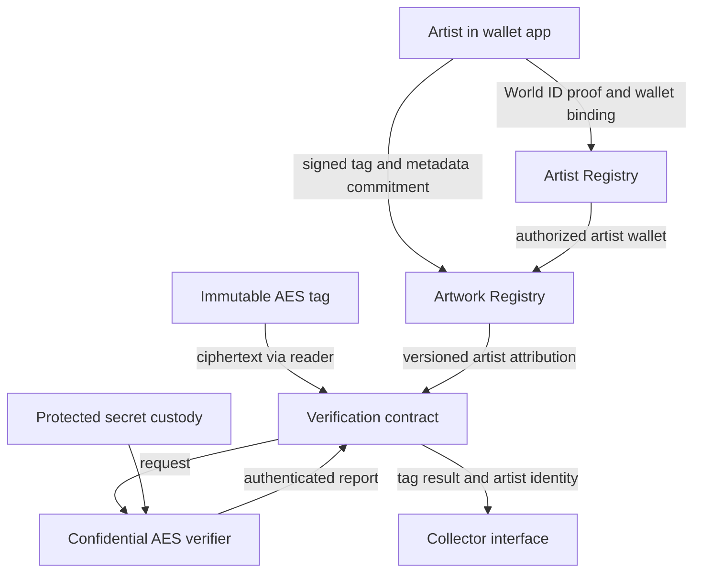

# Immutable AES tags + World ID artist attribution

## 1. Outcome and fixed constraints

An artist associates signed artwork metadata with a registered physical tag. A collector scans the tag and receives an on-chain-backed result containing tag validation, metadata commitment, signing wallet, and an application-scoped artist identifier backed by World ID.

Hard constraints:

- The tag cannot be changed. Its existing message remains AES-encrypted `id || counter || check byte`.
- Only previously registered, active tag IDs are accepted.
- A newly accepted counter must exceed the last accepted counter for that tag.
- The AES secret never enters public blockchain state or public execution.
- The artist explicitly approves/signs metadata using a wallet associated with their World ID verification.
- Verification returns the artist identity reference as well as the tag result.

“Tag content” means logical metadata associated with the tag ID. It does NOT mean adding metadata or a signature to the immutable encrypted payload or writing new data into the chip.

## 2. Three separate claims

| Evidence                                           | Establishes                                                                           | Does not establish                                                         |
| -------------------------------------------------- | ------------------------------------------------------------------------------------- | -------------------------------------------------------------------------- |
| AES validation + registered ID + advancing counter | A message passes the legacy tag protocol and current registry/replay rules            | Physical proximity now, ownership, or authenticity of the attached artwork |
| World ID proof                                     | The selected human/uniqueness credential policy was satisfied in the configured scope | Legal name, artistic reputation, authorship, or wallet control by itself   |
| Artist wallet signature                            | The authorized wallet approved the exact metadata/tag association                     | That the person physically made the artwork or still owns it               |

Product wording: “Registered tag; metadata signed by a World-ID-verified artist account.” Do not claim “World ID certifies this artwork.” A removable tag can be transferred to a counterfeit object; tamper-evident attachment and provenance procedures are separate requirements.

## 3. What ‘artist World ID’ means

World ID is not the wallet signing key and should not be modeled as a global public person number. The documented proof flow exposes scoped nullifiers; IDKit describes these as per-app, per-action identifiers. Wallet signing is a separate capability. [World ID integration](https://docs.world.org/world-id/idkit/integrate), [wallet signing](https://docs.world.org/mini-apps/commands/sign-message).

Define a fixed artist-enrollment scope and an application identifier:

```javascript
artistId = H(
  canonicalEncode(
    "ARTIST_ID_V2",
    identityProvider,
    protocolVersion,
    identityScope,
    verifiedNullifier,
  ),
);
```

`artistId` is our application identifier backed by World ID, not a provider-issued global identity. Store its provider, scope, policy and protocol version. Do not derive it from a nullifier supplied without verified proof. Do not generate a new action scope for every artwork: that would undermine stable artist attribution.

Return `artistId`, `identityProvider: "world-id"`, `identityScope`, and verification status. Exposing the raw scoped nullifier is unnecessary by default. A display name is optional self-declared metadata, not verified legal identity. Explain to the artist that publishing a stable identifier links their works publicly; obtain explicit consent before enrollment publication.

### 3.1 Selfie Check without Orb

Selfie Check is an optional World credential for this project. It can be used without Orb, passport, or another prerequisite credential, provided the feature is enabled for the application and the user has the World ID App. The current World documentation describes it as a medium-assurance credential based on liveness and facial similarity. It supports human-presence, continuity, eligibility, and abuse-prevention use cases; it does not provide a strict one-person-one-account guarantee. It also has a 90-day inactivity window, after which another check may be requested. See [Selfie Check](https://docs.world.org/world-id/credentials/11).

Use the two mechanisms for separate claims:

```javascript
wallet signature  = this wallet approved these exact metadata bytes
Selfie Check      = a live person passed the configured World human-presence flow
World ID proof    = the selected World proof/uniqueness policy was satisfied
```

For the hackathon MVP, use Selfie Check once during artist enrollment rather than during every tag scan or metadata signature. Store the credential type, World action/scope, proof timestamp, protocol version, and an expiry/freshness policy. A collector scan should read the artist attribution already stored on-chain; the artist does not need to be online.

Selfie Check is not a substitute for the wallet signature. An artist with a valid Selfie Check but without a valid signature cannot publish metadata. Conversely, a wallet signature without the required artist-enrollment credential should be shown as signed by the wallet but not as a World-verified artist attribution.

This integration also makes the project eligible for the ETHGlobal World Selfie Check track if the final app uses the feature meaningfully, demonstrates a working flow, and includes the requested integration feedback. The World Sandbox must be enabled for the app; sandbox proofs are for integration testing and are not production identity evidence. See [ETHGlobal World requirements](https://ethglobal.com/events/ethonline2026/prizes/world) and [Sandbox testing](https://docs.world.org/world-id/sandbox/testing-selfie-check).

## 4. Architecture



Components may be modules within fewer contracts for the hackathon, but trust boundaries remain explicit:

- Artist Registry: verified enrollment, wallet authorization and identity status.
- Tag Registry: permitted physical IDs, key policy, activation and monotonic counter state.
- Artwork Registry: immutable signed revisions linking tag, artist and metadata.
- Verification contract: requests, anti-replay checks and atomic finalization.
- Confidential verifier: legacy AES decryption only; it does not invent artist identity or authoritatively manage registry state.
- Metadata storage: content-addressed or otherwise byte-verifiable documents and assets; never trust a mutable URL alone.
- UI/indexer: renders contract-backed results; not a verification authority.

## 5. Artist onboarding: World ID AND wallet control

1. Artist connects a wallet, reviews public-linkability notice, and requests enrollment.
2. Generate a domain-separated binding challenge containing wallet address, chain, Artist Registry address, operation, nonce and expiry.
3. Artist signs the binding challenge with the wallet.
4. Request World ID proof for the fixed enrollment scope, binding the same wallet/challenge through the supported proof-context mechanism.
5. Verify both proof and signature; enforce exact expected context, production environment, allowed credential policy, proof freshness and nonce expiry.
6. Derive `artistId` from verified output; reject replayed enrollment and unauthorized replacement of an existing wallet binding.
7. Persist the artist record and verified wallet binding; emit enrollment event without proof secrets or personal data.

Pin SDK/protocol versions and credential policy before implementation. Current World documentation distinguishes proof versions and supports context binding in applicable flows; do not combine legacy and newer proof fields into an invented interface. [IDKit integration](https://docs.world.org/world-id/idkit/integrate).

### Verification trust boundary

Preferred: a supported, audited on-chain World ID verification path on the selected chain, with contract-enforced context checks. Feasibility is an integration gate, not an assumption.

Hackathon fallback: an enrollment service verifies World ID with the supported service and issues a narrowly scoped, expiring attestation to the Artist Registry. The contract authenticates its issuer and consumes the nonce. This introduces trusted identity-attestation infrastructure; label it clearly and do not describe it as trustless on-chain World ID verification. A frontend `verified: true` flag is never evidence.

Artist enrollment happens once per account, not once per artwork or collector scan. Collector scans do not require the artist to be online or to generate another World ID proof.

## 6. Tag allocation and artwork publication

World ID verification must not let any human claim any registered tag. Separate admission and allocation:

1. Registrar registers the canonical tag ID and reserves it for the intended artist account/wallet.
2. Artist completes enrollment, scans that tag, and obtains an accepted enrollment-purpose read bound to their request.
3. Artist creates the metadata document, reviews its human-readable rendering, and approves a signature over its digest and tag association.
4. Publication checks artist status, authorized signer, tag reservation, accepted read ownership/purpose, signature, nonce and deadline.
5. Atomically consume that enrollment read for publication and create the first immutable artwork revision.

The enrollment read is operational evidence of access to a message, not a cryptographic guarantee of physical presence: the unchanged tag cannot authenticate a wallet challenge. Registrar allocation prevents simple public-scan-based artwork hijacking.

Tag-counter consumption occurs when the AES report finalizes; publication must not compare the same counter as a new read. It consumes a separate, single-use publication authorization referencing that accepted enrollment request.

## 7. Metadata and artist signature

Suggested metadata fields: schema version, artwork ID, title, description, medium, creation date/year, edition information, asset digests, asset URIs, and optional artist display name. Do not include biometric data or private identity documents.

Use a specified canonical JSON serialization and hash algorithm, with byte-level golden vectors. Commit to asset hashes as well as URIs. Metadata serialization is application-defined and must be identical in client, verifier and tests.

Conceptual EIP-712 signed payload:

```javascript
Domain: ((name = "PhysicalArtwork"), (version = "2"), chainId, verifyingContract);
ArtworkAttestation: tagKey;
artworkId;
artistId;
signerWallet;
metadataHash;
metadataVersion;
previousRevisionHash;
enrollmentRequestId;
signerNonce;
deadline;
```

Do not sign only a title, URI, or metadata hash without the tag and artist binding. Otherwise attribution can be copied to another tag or contract. Use canonical typed encoding, not ambiguous concatenation.

World MiniKit documents typed-data signing; verify compatibility with the chosen wallet/chain and pin versions. [Sign Typed Data](https://docs.world.org/mini-apps/commands/sign-typed-data).

Support contract-wallet signature validation, not just EOA `ecrecover`. Validate contract signatures on the wallet’s supported chain/state through the applicable standard; cross-chain wallet validation must not be assumed. Publication records the signature-validation outcome, signing wallet and block. Historical attribution is not reinterpreted merely because wallet authorization changes later.

## 8. Collector verification flow

1. Collector obtains the immutable encrypted tag message.
2. Commit/reveal binds ciphertext and request context to requester, chain, contract, purpose and random salt; apply a chain-appropriate delay and expiry.
3. Confidential verifier decrypts using approved legacy key policy, validates exact payload and emits authenticated `(requestId, ciphertextHash, tagKey, counter, keyVersion, protocolVersion, result)` with chain/contract binding.
4. Contract checks trusted report path, pending/unexpired request, expected versions, active registered tag and strictly advancing counter.
5. In the same transaction, update the counter and snapshot the current artwork revision and artist reference.
6. Store/emit a receipt. Collector retrieves the signed metadata and verifies its bytes against the committed hash.
7. Display separate tag, attribution, identity and metadata-availability statuses.

The AES verifier need not handle World ID secrets or artist keys. The application’s combined result returns artist information from on-chain attribution, not from decrypted tag bytes or caller input.

An accepted tag read may have no artwork association. Return `tagStatus=accepted`, `attributionStatus=missing`, `artist=null`; never fabricate identity or show a fully authenticated artwork badge. Define `artworkVerified` as the conjunction of accepted tag read, valid published attribution, accepted artist-status policy, and matching retrieved metadata bytes. Record metadata availability separately from integrity.

## 9. Data model and result contract

Illustrative schemas, not deployable Solidity:

```javascript
ArtistRecord: (artistId, identityProvider, identityScope, protocolVersion);
(credentialPolicy, enrollmentBlock, identityEvidenceRef, status);
WalletAuthorization: (artistId, wallet, validFrom, revokedAt, authorizationVersion);
TagRecord: (tagKey, registered, active, counterInitialized, lastCounter);
(keyPolicyVersion, allocatedArtistId);
ArtworkRevision: (tagKey, artworkId, artistId, signerWallet, metadataHash);
(metadataURI, version, previousRevisionHash, attestationDigest);
(signatureEvidenceRef, publicationBlock, status);
VerificationReceipt: (requestId, requester, purpose, ciphertextHash, tagKey, counter);
(tagStatus, artworkRevisionHash, artistId, identityStatusAtVerification);
acceptanceBlock;
```

Logical async result example (placeholders, not real IDs):

```javascript
{
  "requestId": "<request>",
  "tag": {"tagKey": "<registered-tag>", "counter": "124", "status": "accepted"},
  "artwork": {"artworkId": "<artwork>", "version": 1, "metadataHash": "<digest>", "attributionStatus": "valid"},
  "artist": {
    "artistId": "<application-scoped-id>",
    "identityProvider": "world-id",
    "identityScope": "<fixed-enrollment-scope>",
    "signerWallet": "<wallet>",
    "identityStatusAtVerification": "verified"
  },
  "receipt": {"chainId": "<chain>", "transactionHash": "<tx>", "blockNumber": "<block>"}
}
```

Render counters as decimal strings in JSON to avoid JavaScript integer truncation. Do not turn historical receipt retrieval into a fresh accepted scan. Expose current artist/revocation status separately from the receipt’s historical snapshot.

## 10. Counter semantics and limitations corrected from v1

The chain invalidates counters at or below the latest ACCEPTED counter. It cannot know a newer physical read occurred if that read was never submitted. Therefore a previously generated but never consumed message may remain acceptable even after a subsequent unreported physical scan. Do not promise immediate invalidation on every physical read.

Use explicit first-read initialization policy; imported tags require a migration counter from an approved snapshot. Preserve counters across suspension, reactivation and upgrades; never reset on metadata changes or wallet rotation. Overflow must fail closed according to a documented retirement policy.

Commit/reveal mitigates public-mempool copying after a private commitment; it does not prove possession, stop theft before commitment, or provide absolute protection against censorship and adverse ordering. Claimed ciphertext retries must remain bound to the original requester; expiry must not reopen public ciphertext for a different recipient. Test the actual state machine rather than assuming a one-block delay solves every race.

## 11. AES and infrastructure requirements retained

Before implementation obtain tag model, AES key size/mode, IV/nonce rules, padding, exact ID/counter/check layout, endianness, check-byte algorithm, key scope, counter limits and test vectors. Never invent these values.

Preferred investigation: confidential AES execution with protected secret delivery and authenticated on-chain reporting. Chainlink Confidential Workflows was the v1 candidate; access, supported networks, deployment status and secret-custody guarantees must be rechecked before implementation. [Chainlink confidential workflows](https://docs.chain.link/cre/concepts/confidential-workflows).

Threshold secret delivery into a TEE is not the same as jointly computing AES over key shares. A ZK proof of AES execution is a complementary/fallback implementation: an ordinary prover still knows the AES key. An approved key commitment and program/version binding are required; proving with any arbitrary key is insufficient. Neither TEE nor ZK repairs weak legacy message authentication. One check byte alone is not a modern cryptographic MAC.

Per-tag key selection cannot depend on a concealed ID unless the legacy system provides another selector. Treat caller key hints as untrusted, bind approved key policy to the resulting registered tag and report, and prohibit unbounded trial decryption. No AES keys, plaintext, identity secrets or biometric data in public logs, transactions or source control.

## 12. Updates, recovery and governance

- Metadata: immutable signed revisions; updates append history and require the authorized artist’s signature, incremented nonce and previous-revision binding. No silent replacement at a URL.
- Artist attribution: do not permit metadata updates to change the originating artist. Any correction is an explicit, auditable exceptional process.
- Wallet rotation: preserve artistId; require an approved recovery protocol with fresh identity evidence and explicit authorization rules. Never overwrite based only on matching user-supplied IDs. Freeze automatic recovery until tested for the selected World ID version.
- Identity revocation/suspension: preserve historical signatures and receipts, display current status separately. Set a documented freshness policy; an old enrollment is not a fresh proof on every scan.
- Governance: separate registrar, identity-attester, emergency-pause and configuration roles. Production multisig/timelock; no pause or upgrade may erase counters or attribution history.
- Ownership transfer: separate from authorship and out of scope for MVP. A collector buying an artwork does not replace its original artist.

## 13. Decisions and motivations

| Decision                                 | Motivation                                                                   |
| ---------------------------------------- | ---------------------------------------------------------------------------- |
| External signed metadata, unchanged tag  | Honors immutable hardware constraint                                         |
| World ID plus wallet signature           | Separates human-credential evidence from explicit content approval           |
| Scoped artistId                          | Provides repeatable application attribution without claiming global identity |
| On-chain artist/tag/artwork bindings     | Collector does not rely on a mutable backend mapping                         |
| Registrar allocation before artist claim | Human verification alone does not authorize claiming someone else’s tag      |
| Immutable signed revision history        | Prevents content substitution and preserves historical evidence              |
| Artist-independent collector scans       | Works when the artist is offline                                             |
| Snapshot attribution at finalization     | Prevents UI race between a scan and metadata update                          |
| Separate verification statuses           | Avoids equating tag validity with artwork authenticity                       |
| Explicit adapter trust                   | Backend-verified identity is not silently presented as trustless             |

## 14. Hackathon implementation plan

1. Protocol fixture: reproduce legacy AES validation with synthetic keys and real-tag vectors supplied securely.
2. Registry: implement registered tags, allocation, counter state and mock authenticated async verifier.
3. Artist: integrate wallet connection, World ID enrollment and replay-safe wallet binding; mark simulations visibly.
4. Publication: metadata editor, canonical digest, typed signature, allocation checks, single-use enrollment authorization.
5. Scan: verify tag, retrieve attribution, render artistId/wallet/metadata and transaction evidence.
6. Integrate real confidential provider if accessible; otherwise label the actual mock/centralized trust boundary prominently.
7. Demonstrate: artist enrollment and signing; collector scan; old-message replay rejection; unregistered tag rejection; metadata tampering detection; unauthorized artist claim rejection.

Do not require minting, payments, ownership markets, pure MPC AES or simultaneous TEE+ZK integration for the first demo.

## 15. Acceptance tests and AI guardrails

- Valid AES with unregistered/inactive ID fails; equal/lower counters fail; out-of-order finalization never decreases state.
- Wrong request, chain, contract, purpose, key policy or report source fails; duplicate finalization and expired requests fail.
- World ID proof bound to wallet A cannot enroll wallet B; wrong scope, environment, credential or replayed nonce fails.
- A valid wallet signature without verified identity cannot publish as a verified artist.
- A verified human without tag allocation cannot claim it.
- Changing tag, artistId, metadata bytes, revision, chain or contract invalidates the artist attestation.
- Contract-wallet signatures are tested on the actual chosen deployment chain; never assume EOA recovery is enough.
- Publication consumes an enrollment authorization once without consuming its counter twice.
- Metadata update cannot reset tag counters or rewrite earlier signatures and receipts.
- Collector gets artist identity from the registered artwork revision, never a client-supplied field.
- Missing artwork association returns artist=null; missing metadata is not reported as metadata verified.
- Wallet rotation/revocation cannot retroactively change the recorded signer of an existing work.
- Artist offline: scanning still works. Reading a stored receipt is clearly historical, not a new proof of freshness.
- Synthetic identities/keys and mock verifiers cannot be enabled silently in production.

Implementation agents must preserve all fixed constraints, use exact protocol vectors, define canonical encodings, and document dependencies and trusted issuers. No claim of physical presence, legal identity, copyright ownership, or global World ID should be inferred from the combined result.

## 16. Open implementation decisions

Tag protocol details; World ID protocol and credential policy; exact proof-to-wallet binding; available on-chain verification route; target chain and wallet compatibility; confidential-provider access; artist privacy consent; reservation authority; metadata canonicalization and persistence; key provisioning; wallet recovery; artist-status freshness; request timeout/retry policy; throughput and fees; existing counter migration; physical tag attachment/tamper evidence.

This proposal defines defaults sufficient to build a scoped prototype. These integration/security gates must be resolved before production, not filled with guessed provider APIs.
